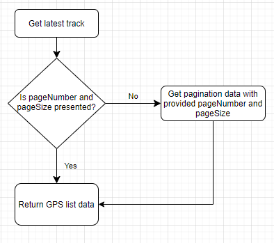
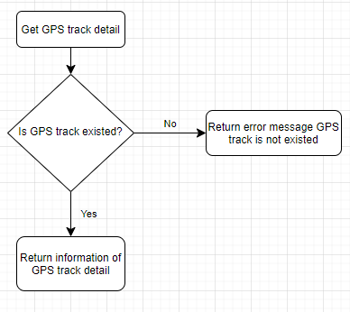
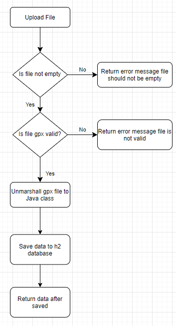

## How to run this application
At the command prompt, type `mvn spring-boot:run` it will run on `default` profile with port `9999`

Here are some workflows for the APIs:

- Get list of latest tracks - GET : http://localhost:9999/gps/latest/track

- Get detail of GPS detail - GET : http://localhost:9999/gps/detail/{id}

- Upload a gpx file - POST : http://localhost:9999/gps/upload

